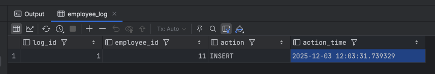
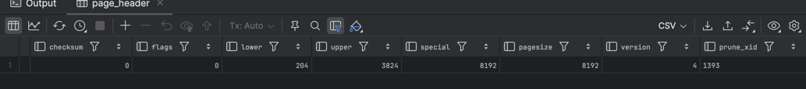

# 1. Проблемы параллелизма

## 1.1 Типовые проблемы параллелизма

- Грязное чтение

>In PostgreSQL, you can request any of the four standard transaction isolation levels, but internally only three distinct isolation levels are implemented, i.e., PostgreSQL's Read Uncommitted mode behaves like Read Committed. This is because it is the only sensible way to map the standard isolation levels to PostgreSQL's multiversion concurrency control architectur

То есть можно выбрать уровень изоляции *Read Unocmmited*, но работать он все равно будет как *Read Commited*, так что никакого грязного чтения невозможно

- Неповторяющееся чтение

```sql
\echo '[Session A] begin'
BEGIN;

UPDATE employee SET first_name = 'AAA' WHERE employee_id = 1;
\echo '[Session A] updated but not committed'

SELECT pg_sleep(5);

COMMIT;
\echo '[Session A] COMMIT'
```

```sql
\echo '[Session B] BEGIN'
BEGIN;

SELECT pg_sleep(2);

SELECT first_name FROM employee WHERE employee_id = 1;

SELECT pg_sleep(5);

SELECT first_name FROM employee WHERE employee_id = 1;

COMMIT;
\echo '[Session B] COMMIT'
```

Выше приведены файлы транзакций, которые я одновременно запускал с помощью скрипта start_sessions.sh. Приведу код ниже, далее он будет использоваться скорее всего без значительных изменений
```bash
#!/bin/bash

psql -U bobrnebobr -d postgres -f sessions/sessionA.sql > session_a.log &
PID_A=$!

psql -U bobrnebobr -d postgres -f sessions/sessionB.sql > session_b.log &
PID_B=$!

wait $PID_A
wait $PID_B

echo "Both sessions finished"
```

Результаты вывода скрипта:
1) для сессии A
```log
[Session A] begin
BEGIN
UPDATE 1
[Session A] updated but not committed
 pg_sleep 
----------
 
(1 row)

COMMIT
[Session A] COMMIT
```

2) для сессии B
```txt
[Session B] BEGIN
BEGIN
 pg_sleep 
----------
 
(1 row)

 first_name 
------------
 Иван
(1 row)

 pg_sleep 
----------
 
(1 row)

 first_name 
------------
 AAA
(1 row)

COMMIT
[Session B] COMMIT
```

Как видим, действительно получили неповторяющееся чтение. При первом чтении результат был **Иван**. При втором **AAA**.

- Фантомное чтение

```sql
\echo '[Session A] BEGIN'

BEGIN;

\echo '[Session A] FIRST SELECT (before insert in B)'
SELECT COUNT(*) AS before_count
FROM employee
WHERE position_id = 5;

SELECT pg_sleep(5);

\echo '[Session A] SECOND SELECT (after insert in B)'
SELECT COUNT(*) AS after_count
FROM employee
WHERE position_id = 5;

COMMIT;
\echo '[Session A] COMMIT'
```

```sql
\echo '[Session B] BEGIN'

SELECT pg_sleep(2);

BEGIN;
\echo '[Session B] INSERT phantom row'
INSERT INTO employee(first_name, last_name, phone, email, sex, position_id)
VALUES ('Phantom', 'Row', '999999', 'phantom@example.com', 'Male', 5);

COMMIT;
\echo '[Session B] COMMIT'
```

Результаты:
1) для сессии A:
```log
[Session A] BEGIN
BEGIN
[Session A] FIRST SELECT (before insert in B)
 before_count 
--------------
            1
(1 row)

 pg_sleep 
----------
 
(1 row)

[Session A] SECOND SELECT (after insert in B)
 after_count 
-------------
           2
(1 row)

COMMIT
[Session A] COMMIT
```

2) для сессии B:
```log
[Session B] BEGIN
 pg_sleep 
----------
 
(1 row)

BEGIN
[Session B] INSERT phantom row
INSERT 0 1
COMMIT
[Session B] COMMIT
```
Как видим все сработало. После чтения сессией A сессия B вставляет фантомную строку в данные. При повторном чтении строк оказывается, как и ожидалось, на одну больше.

- Аномалия сериализации (Write Skew / Lost Update)

Файлы транзакций:
```sql
BEGIN ISOLATION LEVEL REPEATABLE READ;

\echo 'Session A: Initial read of workers on position 3'
SELECT employee_id, on_work
FROM employee
WHERE position_id = 3;

SELECT pg_sleep(5);

\echo 'Session A: Setting employee 3 off work'
UPDATE employee
SET on_work = false
WHERE employee_id = 3;

\echo 'Session A: COMMIT'
COMMIT;
```

```sql
BEGIN ISOLATION LEVEL REPEATABLE READ;

\echo 'Session B: Initial read of workers on position 3'
SELECT employee_id, on_work
FROM employee
WHERE position_id = 3;

SELECT pg_sleep(2);

\echo 'Session B: Setting employee 8 off work'
UPDATE employee
SET on_work = false
WHERE employee_id = 8;

\echo 'Session B: COMMIT'
COMMIT;
```

Логи:
```log
BEGIN
Session A: Initial read of workers on position 3
 employee_id | on_work 
-------------+---------
           3 | t
           8 | t
(2 rows)

 pg_sleep 
----------
 
(1 row)

Session A: Setting employee 3 off work
UPDATE 1
Session A: COMMIT
COMMIT
```

```log
BEGIN
Session B: Initial read of workers on position 3
 employee_id | on_work 
-------------+---------
           3 | t
           8 | t
(2 rows)

 pg_sleep 
----------
 
(1 row)

Session B: Setting employee 8 off work
UPDATE 1
Session B: COMMIT
COMMIT
```

Пусть в компании одновременно не должны работать люди с позицией 3. Тогда employee 3 смотрит что сейчас работают одновременно 3 и 8 => он может уйти. 8 смотрит то же самое и решает, что может уйти. Тогда получается в итоге, что никто не остается работать. Это называется lost update.

## 1.2 Блокировки

Код первой сессии:
```sql
BEGIN;

UPDATE employee
SET first_name = 'Locked_by_A'
WHERE employee_id = 1;

SELECT pid, locktype, mode, granted, relation::regclass, page, tuple
FROM pg_locks
WHERE pid = pg_backend_pid();

COMMIT
```

Заметим, что не совершаем коммит!

Код второй сессии:
```sql
BEGIN;

UPDATE employee
SET first_name = 'Locked_by_B'
WHERE employee_id = 1;

SELECT pid, locktype, mode, granted, relation::regclass, page, tuple
FROM pg_locks
WHERE pid = pg_backend_pid();

COMMIT;
```

Выводы:
```log
BEGIN
UPDATE 1
  pid  |   locktype    |       mode       | granted |      relation      | page | tuple 
-------+---------------+------------------+---------+--------------------+------+-------
 72585 | relation      | AccessShareLock  | t       | pg_locks           |      |      
 72585 | relation      | RowExclusiveLock | t       | employee_email_key |      |      
 72585 | relation      | RowExclusiveLock | t       | employee_pkey      |      |      
 72585 | relation      | RowExclusiveLock | t       | employee           |      |      
 72585 | relation      | RowExclusiveLock | t       | employee_phone_key |      |      
 72585 | virtualxid    | ExclusiveLock    | t       |                    |      |      
 72585 | transactionid | ExclusiveLock    | t       |                    |      |      
(7 rows)

 commit 
--------
 
(1 row)
```

```log
BEGIN
UPDATE 1
  pid  |   locktype    |       mode       | granted |      relation      | page | tuple 
-------+---------------+------------------+---------+--------------------+------+-------
 72586 | relation      | AccessShareLock  | t       | pg_locks           |      |      
 72586 | relation      | RowExclusiveLock | t       | employee_email_key |      |      
 72586 | relation      | RowExclusiveLock | t       | employee_pkey      |      |      
 72586 | relation      | RowExclusiveLock | t       | employee           |      |      
 72586 | relation      | RowExclusiveLock | t       | employee_phone_key |      |      
 72586 | virtualxid    | ExclusiveLock    | t       |                    |      |      
 72586 | transactionid | ExclusiveLock    | t       |                    |      |      
(7 rows)

COMMIT
```

В первой сессии мы начали транзакцию и обновили строку, установив эксклюзивную блокировку.
Вторая сессия попыталась обновить ту же строку и оказалась в ожидании, пока блокировка не будет снята.
С помощью pg_locks видно, что первая сессия держит блокировку, а вторая ждёт.
После выполнения COMMIT в первой сессии блокировка освобождается.
Вторая сессия продолжает выполнение и успешно обновляет строку.

## 1.3 Advisory блокировки

Файлы сессий:
```sql
BEGIN;

SELECT pg_advisory_lock(1001);
SELECT pg_advisory_lock(2001);

UPDATE employee
SET position_id = 2
WHERE employee_id = 1;

SELECT pg_advisory_unlock(2001);
SELECT pg_advisory_unlock(1001);

COMMIT;
```

```sql
BEGIN;

SELECT pg_advisory_lock(1001);
SELECT pg_advisory_lock(2001);

UPDATE employee
SET position_id = 2
WHERE employee_id = 2;

SELECT pg_advisory_unlock(2001);
SELECT pg_advisory_unlock(1001);

COMMIT;
```

Логи:
```log
BEGIN
 pg_advisory_lock 
------------------
 
(1 row)

 pg_advisory_lock 
------------------
 
(1 row)

UPDATE 1
 pg_advisory_unlock 
--------------------
 t
(1 row)

 pg_advisory_unlock 
--------------------
 t
(1 row)

COMMIT
```

```log
BEGIN
 pg_advisory_lock 
------------------
 
(1 row)

 pg_advisory_lock 
------------------
 
(1 row)

UPDATE 1
 pg_advisory_unlock 
--------------------
 t
(1 row)

 pg_advisory_unlock 
--------------------
 t
(1 row)

COMMIT
```

Цель операции: Синхронизировать параллельные обновления сотрудников, чтобы предотвратить логический конфликт при переводе сотрудников на одну и ту же позицию.

Что произошло: В обеих сессиях транзакции взяли advisory lock с идентификаторами 1001 и 2001 перед обновлением данных.
Это гарантировало, что операции выполняются последовательно для одного и того же логического ресурса (позиции), даже если транзакции запущены параллельно.
Ожидаемый результат — перевод сотрудников без конфликтов и корректная последовательность обновлений.
Фактический результат совпал с ожидаемым: каждая транзакция успешно обновила соответствующего сотрудника и сняла lock после завершения.

# 2. Хранимые процедуры и функции

## 2.1 Создание хп и функций

Функиця:
```sql
CREATE OR REPLACE FUNCTION get_full_name(emp_id INT)
RETURNS VARCHAR AS $$
DECLARE
    full_name VARCHAR;
BEGIN
    SELECT first_name || ' ' || last_name
    INTO full_name
    FROM employee
    WHERE employee_id = emp_id;

    RETURN full_name;
END;
$$ LANGUAGE plpgsql;

SELECT get_full_name(2);
```

Процедура:
```sql
CREATE OR REPLACE PROCEDURE transfer_employee(emp_id INT, new_position INT)
LANGUAGE plpgsql
AS $$
BEGIN
    UPDATE employee
    SET position_id = new_position
    WHERE employee_id = emp_id;

    COMMIT;
END;
$$;

CALL transfer_employee(1, 3);
```

Отличия:
Функция возвращает значение и вызывается внутри SQL-запроса, например через SELECT.
Процедура не обязана возвращать значение и вызывается через CALL для выполнения действий с побочными эффектами.
Функция не может управлять транзакциями (COMMIT/ROLLBACK), а процедура может.
Функции чаще используют для вычислений и преобразований данных, процедуры — для сложной бизнес-логики и последовательных операций с таблицами.

## 2.2 Циклы в процедурах

Цикл:
```sql
CREATE OR REPLACE PROCEDURE transfer_employees_loop()
LANGUAGE plpgsql
AS $$
DECLARE
    emp_record employee%ROWTYPE;
BEGIN
    FOR emp_record IN
        SELECT * FROM employee WHERE position_id = 1
    LOOP
        UPDATE employee
        SET position_id = 2
        WHERE employee_id = emp_record.employee_id;
    END LOOP;
END;
$$;

CALL transfer_employees_loop();
```

Сетевой подход:
```sql
CREATE OR REPLACE PROCEDURE transfer_employees_setbased()
LANGUAGE plpgsql
AS $$
BEGIN
    UPDATE employee
    SET position_id = 2
    WHERE position_id = 1;
END;
$$;

CALL transfer_employees_setbased();
```

Если смотреть по времени, то сетевой подход сработал быстрее. Но у меня и записей в базе штук 5 всего) 

При использовании цикла каждая запись обрабатывается отдельно, что создаёт дополнительные накладные расходы на выполнение множества UPDATE.
Сетевой подход обновляет все записи одним запросом, поэтому выполняется быстрее, особенно при большом количестве данных.
Даже при небольшом объёме данных (как в нашем примере — около 5 записей) разница практически незаметна, но принцип остаётся тот же.
Циклы удобны, когда для каждой строки требуется дополнительная логика или проверки перед обновлением.
Сетевой подход предпочтителен для массовых операций без сложных условий, так как минимизирует нагрузку на сервер и ускоряет выполнение.

# 3. Триггеры

## 3.1. Создание и тестирование триггера

Код для лога:
```sql
CREATE TABLE IF NOT EXISTS employee_log
(
    log_id SERIAL PRIMARY KEY,
    employee_id INT,
    action VARCHAR(50),
    action_time TIMESTAMP DEFAULT now()
);

CREATE OR REPLACE FUNCTION log_employee_insert()
RETURNS TRIGGER AS $$
BEGIN
    INSERT INTO employee_log(employee_id, action)
    VALUES (NEW.employee_id, 'INSERT');

    RETURN NEW;
END;
$$ LANGUAGE plpgsql;

CREATE TRIGGER before_employee_insert
BEFORE INSERT ON employee
FOR EACH ROW
EXECUTE FUNCTION log_employee_insert();

INSERT INTO employee(first_name, last_name, phone, email, sex, position_id)
VALUES ('Test', 'User', '12345', 'test@example.com', 'Male', 1);

SELECT * FROM employee_log ORDER BY log_id DESC LIMIT 1;
```

Результаты:


При добавлении нового сотрудника триггер сработал автоматически и создал запись в таблице employee_log.
В лог была внесена информация о employee_id вставленного сотрудника и действие INSERT.
Это подтверждает корректную работу триггера и его способность отслеживать события в таблице employee.
Триггер позволяет централизованно вести журнал изменений без необходимости вручную добавлять записи в лог.
Таким образом, бизнес-логика по логированию выполняется автоматически при каждой вставке.

## 3.2 Циклический триггер

```sql
CREATE TABLE IF NOT EXISTS position_counter
(
    position_id INT PRIMARY KEY,
    employee_count INT DEFAULT 0
);

INSERT INTO position_counter(position_id, employee_count)
SELECT position_id, COUNT(*)
FROM employee
GROUP BY position_id;

CREATE OR REPLACE FUNCTION update_position_counter()
RETURNS TRIGGER AS $$
BEGIN
    IF OLD.position_id IS NOT NULL THEN
        UPDATE position_counter
        SET employee_count = employee_count - 1
        WHERE position_id = OLD.position_id;
    END IF;

    IF NEW.position_id IS NOT NULL THEN
        UPDATE position_counter
        SET employee_count = employee_count + 1
        WHERE position_id = NEW.position_id;
    END IF;

    RETURN NEW;
END;
$$ LANGUAGE plpgsql;

CREATE TRIGGER trg_employee_update
AFTER UPDATE OF position_id ON employee
FOR EACH ROW
EXECUTE FUNCTION update_position_counter();

CREATE OR REPLACE FUNCTION trigger_back_employee()
RETURNS TRIGGER AS $$
BEGIN
    UPDATE employee
    SET last_name = 'Updated'
    WHERE position_id = NEW.position_id;
    RETURN NEW;
END;
$$ LANGUAGE plpgsql;

CREATE TRIGGER trg_counter_update
AFTER UPDATE ON position_counter
FOR EACH ROW
EXECUTE FUNCTION trigger_back_employee();

UPDATE employee
SET position_id = 1
WHERE employee_id = 1;
```

ChatGPT said:
При обновлении позиции сотрудника триггер корректно уменьшает счетчик на старой позиции и увеличивает на новой.
Это позволяет автоматически поддерживать актуальное количество сотрудников для каждой позиции в таблице position_counter.
Использование OLD и NEW в триггере гарантирует правильное отражение перемещений сотрудников.
Таким образом, триггер обеспечивает целостность данных без необходимости вручную обновлять счетчики.
Результаты проверки показали, что после изменения позиции счетчики обновились корректно для всех затронутых записей.

# 4. Низкоуровневое хранение данных в PostgreSQL

Код:
```sql
CREATE EXTENSION IF NOT EXISTS pageinspect;

SELECT get_raw_page('employee', 0);

SELECT * FROM page_header(get_raw_page('employee', 0));
```

Вывод:


- pd_lsn: логический номер записи (LSN), указывает до какой точки журналов WAL страница была актуализирована.
- pd_checksum: контрольная сумма страницы, используется для проверки целостности данных.
- pd_flags: флаги состояния страницы, показывают, например, есть ли удалённые или используемые кортежи.
- pd_lower: смещение до начала свободного пространства на странице, то есть где начинаются новые кортежи.
- pd_upper: смещение до конца данных кортежей, показывает сколько места уже занято на странице.
- pd_special: смещение до специальной области в конце страницы, которая используется в основном для индексов или служебных данных.
- pd_pagesize_version: размер страницы и версия формата страницы PostgreSQL.
- pd_prune_xid: идентификатор транзакции, до которой были удалены или обрезаны старые кортежи (для управления видимостью и очистки).
Эти поля дают полное представление о том, как PostgreSQL хранит данные на уровне физической страницы, сколько места занято, где свободное пространство и состояние кортежей.