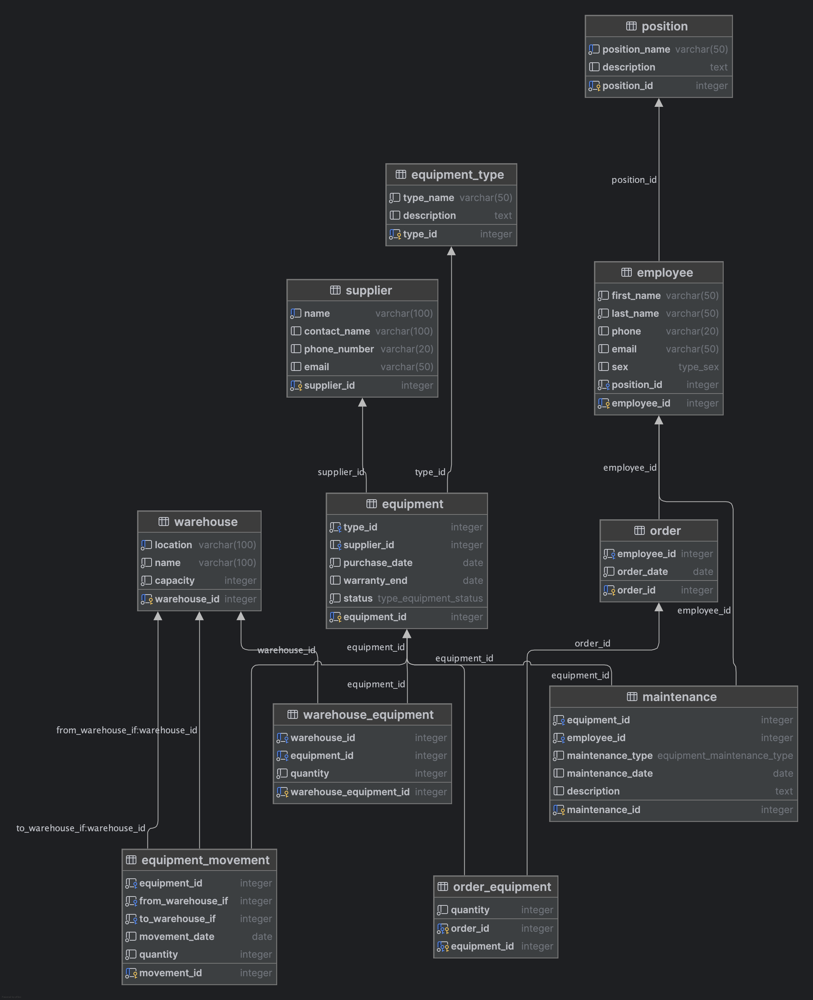

# Отчет по Лабораторной №1

## 1. Описание области

Область: управление складами внутренней корпоративной системы компании.

Допустим, есть какая-то IT-компания, которой в офисе нужны компьютеры, вентиляторы и прочие вещи. Есть склады, на которых
хранятся запасы данного оборудования. Периодически необходимо проводить 
инвентаризацию, проверять оборудование на работоспособность.

Также, работники в случае необходимости могут оформить заказ на получение оборудование со склада.

У оборудования есть поставщики, с которыми можно связаться по вопросам
поставок, гарантий и подобных вещей.

Оборудование может быть по-разному помещено на склады (складов несколько).

Оборудование в случае неисправности нужно ремонтировать и это в бизнес-логике базы данных
тоже необходимо отразить.

База данных предназначена для эффективного управления оборудованием компании.
Она позволяет:

- отслеживать наличие оборудования
- фиксировать заказы сотрудников
- вести учет поставщиков
- контролировать состояние оборудования
- отслеживать перемещения оборудования
- соблюдать целостность и достоверность данных

# 2. Код

```sql
CREATE TYPE type_sex AS ENUM ('Мужской', 'Женский');

CREATE TYPE type_equipment_status AS ENUM ('Пригодно для использования', 'Необходим ремонт', 'Подлежит утилизации', 'Утеряно');

CREATE TYPE equipment_maintenance_type AS ENUM ('Плановый осмотр', 'Ремонт', 'Инспекция');

CREATE TABLE IF NOT EXISTS position (
    position_id SERIAL PRIMARY KEY,
    position_name VARCHAR(50) NOT NULL UNIQUE,
    description TEXT
);

CREATE TABLE IF NOT EXISTS employee (
    employee_id SERIAL PRIMARY KEY,
    first_name VARCHAR(50) NOT NULL,
    last_name VARCHAR(50) NOT NULL,
    phone VARCHAR(20),
    email VARCHAR(50),
    sex type_sex,
    position_id INT NOT NULL REFERENCES position(position_id)
);

CREATE TABLE IF NOT EXISTS warehouse (
    warehouse_id SERIAL PRIMARY KEY,
    location VARCHAR(100) NOT NULL UNIQUE,
    name VARCHAR(100) NOT NULL,
    capacity INT NOT NULL
);

CREATE TABLE IF NOT EXISTS supplier (
    supplier_id SERIAL PRIMARY KEY,
    name VARCHAR(100) NOT NULL UNIQUE,
    contact_name VARCHAR(100),
    phone_number VARCHAR(20),
    email VARCHAR(50)
);

CREATE TABLE IF NOT EXISTS equipment_type (
    type_id SERIAL PRIMARY KEY,
    type_name VARCHAR(50) NOT NULL,
    description TEXT
);

CREATE TABLE IF NOT EXISTS equipment (
    equipment_id SERIAL PRIMARY KEY,
    type_id INT NOT NULL REFERENCES equipment_type(type_id),
    supplier_id INT REFERENCES supplier(supplier_id),
    purchase_date DATE NOT NULL,
    warranty_end DATE,
    status type_equipment_status NOT NULL
);

CREATE TABLE IF NOT EXISTS "order" (
    order_id SERIAL PRIMARY KEY,
    employee_id INT NOT NULL REFERENCES employee(employee_id),
    order_date DATE NOT NULL
);

CREATE TABLE IF NOT EXISTS order_equipment (
    order_id INT NOT NULL REFERENCES "order"(order_id),
    equipment_id INT NOT NULL REFERENCES equipment(equipment_id),
    quantity INT NOT NULL CHECK(quantity > 0),
    PRIMARY KEY (order_id, equipment_id)
);

CREATE TABLE IF NOT EXISTS warehouse_equipment (
    warehouse_equipment_id SERIAL PRIMARY KEY,
    warehouse_id INT NOT NULL REFERENCES warehouse(warehouse_id),
    equipment_id INT NOT NULL REFERENCES equipment(equipment_id),
    quantity INT NOT NULL CHECK (quantity > 0),
    UNIQUE (warehouse_id, equipment_id)
);

CREATE TABLE IF NOT EXISTS maintenance (
    maintenance_id SERIAL PRIMARY KEY,
    equipment_id INT NOT NULL REFERENCES equipment(equipment_id),
    employee_id INT NOT NULL REFERENCES employee(employee_id),
    maintenance_type equipment_maintenance_type NOT NULL,
    maintenance_date DATE,
    description TEXT
);

CREATE TABLE IF NOT EXISTS equipment_movement (
    movement_id SERIAL PRIMARY KEY,
    equipment_id INT NOT NULL REFERENCES equipment(equipment_id),
    from_warehouse_if INT NOT NULL REFERENCES warehouse(warehouse_id),
    to_warehouse_if INT NOT NULL REFERENCES warehouse(warehouse_id),
    movement_date DATE NOT NULL ,
    quantity INT NOT NULL CHECK (quantity > 0)
);
```

# 3. Схема



# 4. Обоснование 3-ей нормальной формы

Грубо говоря, 3-я НФ требует, чтобы:
1. Каждая таблица отражала одну сущность
2. Все неключевые поля зависели не друг от друга, а от первичного ключа

Поэтому, например, у меня в базе данных отделены employee и position

# 5. Теоретические вопросы

## 1. Почему плохо нарушать 3-ю НФ?

- дублирование данных
- сложно обновлять и поддерживать
- сложности в согласовании
- экономим память

## 2. Когда нарушение 3НФ допустимо?

Когда нужна скорость. 

Много соединений таблиц занимают много времени. В моей
лабораторной есть пример косвенного нарушения 3-ей НФ. В таблице equipment есть поле status.
Вообще правильно было бы отдельно создать таблицу с историей проверки оборудования
и там отображать статусы, так как сейчас это поле больше зависит от проверки последней, но решено было
пренебречь в угоду производительности и чаще всего нужна информация только о текущем статусе. Просто для удобства.

## 3. Почему внешние ключи в бд важны и к каким последствиям может привести их отсутствие?

- поддержка связи между таблицами четко регламентированной
- гарантия целостности данных (не сослаться на несуществующую бд)
- легкое поддержание базы